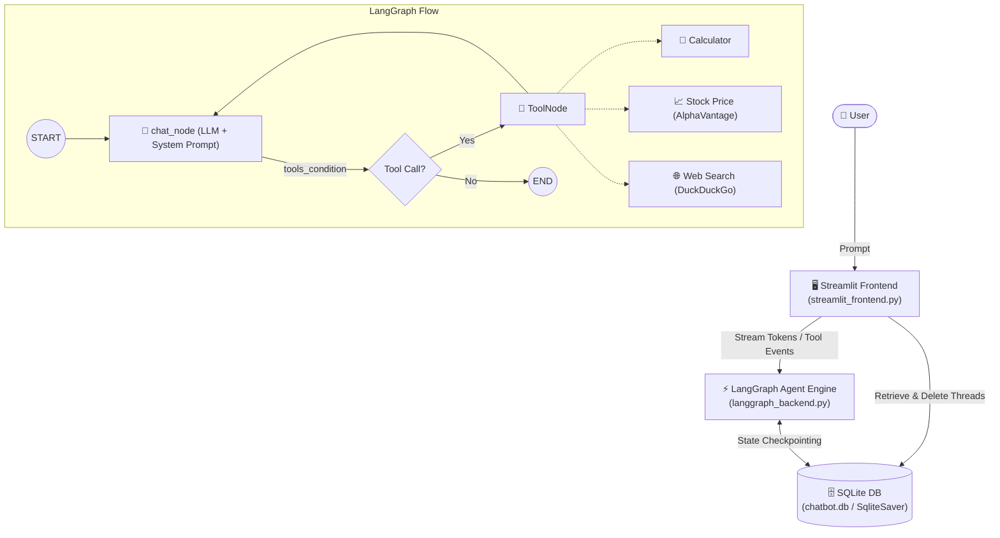

<div align="center">

# 🤖 LangGraph Multi-Thread AI Chatbot

### *An Intelligent, Stateful Conversational Assistant with Multi-Tool Calling Powered by Google Gemini, LangGraph, and Streamlit*

[](https://python.org)
[](https://streamlit.io)
[](https://langchain-ai.github.io/langgraph/)
[](https://ai.google.dev/)
[](https://sqlite.org)

<p align="center">
  <a href="#-overview">Overview</a> •
  <a href="#-key-features">Key Features</a> •
  <a href="#-architecture">Architecture</a> •
  <a href="#-tools-integrated">Tools</a> •
  <a href="#-tech-stack">Tech Stack</a> •
  <a href="#-project-structure">Project Structure</a> •
  <a href="#-getting-started">Getting Started</a>
</p>

---

</div>

## 📖 Overview

This project is a **modern, full-featured stateful AI Chatbot application** built using **LangGraph** for multi-step agent orchestration, **Google Gemini** as the primary LLM reasoning engine, and **Streamlit** for a responsive, real-time interactive user interface.

With built-in **SQLite persistence (`SqliteSaver`)**, conversation threads and state snapshots persist across sessions. The agent is augmented with **system prompt guardrails** and **dynamic tool integration** (Web Search, Financial Market Data, and Math Calculations), providing real-time streaming feedback and tool execution status in the UI.

---

## ✨ Key Features

- 🧠 **LangGraph Cyclic Agent Architecture**: Graph-based execution (`chat_node` $\leftrightarrow$ `tool_node`) with typed state management (`ChatState`) and `add_messages` history reducers.
- 🎯 **System Prompt & Guardrails**: Enforces structured behavior, factual accuracy, concise formatting, and zero hallucinations on real-time data.
- 🛠️ **Integrated Tool Suite**:
  - 🌐 **Web Search**: DuckDuckGo integration for real-time and up-to-date events.
  - 📈 **Stock Market Quotes**: AlphaVantage API integration with timeout safeguards for share prices and ticker metrics.
  - 🧮 **Calculator**: Mathematical evaluation for basic arithmetic calculations.
- 💾 **Persistent SQLite Checkpointing**: Historical conversations are persisted in `chatbot.db` using `SqliteSaver` and restored into the UI across restarts.
- 🔀 **Multi-Thread & Conversation Management**:
  - Seamlessly switch between historical threads.
  - Quick conversation reset / new chat creation with UUID tracking.
  - Sidebar conversation deletion (❌) directly from the UI.
- ⚡ **Real-Time Token & Tool Streaming**:
  - Live chunk streaming for interactive typing.
  - Dynamic `st.status` indicators displaying currently running tools and completed tool summaries.

---

## 🏛️ Architecture



---

## 🛠️ Tools Integrated

| Tool | Function | Description |
| :--- | :--- | :--- |
| **Calculator** | `calculator(first_num, second_num, operation)` | Evaluates `add`, `sub`, `mul`, `div` with zero-division handling. |
| **Stock Price** | `get_stock_price(symbol)` | Retrieves live global quotes for stock tickers (e.g., NVDA, AAPL, TSLA). |
| **Web Search** | `search_web(query)` | Live web search using DuckDuckGo to obtain recent information and news. |

---

## 💻 Tech Stack

| Component | Technology | Purpose |
| :--- | :--- | :--- |
| **Frontend UI** | [Streamlit](https://streamlit.io/) | Interactive sidebar, real-time message stream, and tool status widgets |
| **Orchestration** | [LangGraph](https://langchain-ai.github.io/langgraph/) | Cyclic state graph, message reducers, tool routing, and checkpointing |
| **LLM Provider** | [Google Gemini](https://ai.google.dev/) | Multi-turn reasoning, tool selection, and response generation |
| **Search Engine** | [DuckDuckGo Search](https://duckduckgo.com/) | Live web searches via `langchain-community` |
| **Persistence** | [SQLite3 / SqliteSaver](https://www.sqlite.org/) | Durable thread and checkpoint storage across app restarts |
| **Configuration** | [python-dotenv](https://github.com/theskumar/python-dotenv) | Environment variable and API key management |

---

## 📁 Project Structure

```text
CHATBOT/
├── .env.example             # Template for required API keys & configs
├── .gitignore               # Git exclusion rules (DB, keys, virtualenv, caches)
├── requirements.txt         # Project dependencies with pinned versions
├── req.txt                  # Minimal package list
├── langgraph_backend.py     # LangGraph graph, nodes, LLM, system prompt, & tools
└── streamlit_frontend.py    # Streamlit frontend UI, streaming, & thread navigation
```

---

## 🚀 Getting Started

### 1. Prerequisites

- **Python 3.10+** installed on your system.
- A **Google Gemini API Key** (available at [Google AI Studio](https://aistudio.google.com/)).

### 2. Clone and Setup Environment

```bash
# Clone the repository
git clone https://github.com/Asphane/stateful-gemini-chatbot.git
cd stateful-gemini-chatbot

# Create and activate a virtual environment
python3 -m venv venv
source venv/bin/activate    # On Windows: venv\Scripts\activate

# Install required dependencies
pip install -r requirements.txt
```

### 3. Configure Environment Variables

Create a `.env` file in the root directory (or copy from `.env.example`):

```bash
cp .env.example .env
```

Add your API credentials to `.env`:

```env
GOOGLE_API_KEY=AIzaSyYourActualApiKeyHere
```

### 4. Launch the Application

Run the Streamlit frontend:

```bash
streamlit run streamlit_frontend.py
```

The application will open automatically in your browser at `http://localhost:8501`.

---

## 💡 How It Works

1. **Graph Execution & Guardrails (`langgraph_backend.py`)**:
   - The user's input messages are prepended with `SYSTEM_PROMPT` to enforce concise, tool-oriented, and factual responses.
   - If the model determines that a tool is needed (e.g., calculator, stock lookup, web search), `tools_condition` routes the execution to `ToolNode` and loops the result back to `chat_node`.
   - Every graph step is persisted to `chatbot.db` via `SqliteSaver` under the designated `thread_id`.

2. **Frontend Streaming & Thread Management (`streamlit_frontend.py`)**:
   - Conversations are loaded directly from SQLite checkpoints via `retrieve_all_threads()`.
   - Users can create new chats, switch between previous conversations, or remove threads from the sidebar.
   - Real-time responses stream chunk-by-chunk with dynamic visual feedback for executing tools.

---

## 🤝 Contributing

Contributions, issues, and feature requests are welcome! Feel free to open an issue or pull request.

---

<div align="center">
  <sub>Built with ❤️ using LangGraph & Streamlit</sub>
</div>
