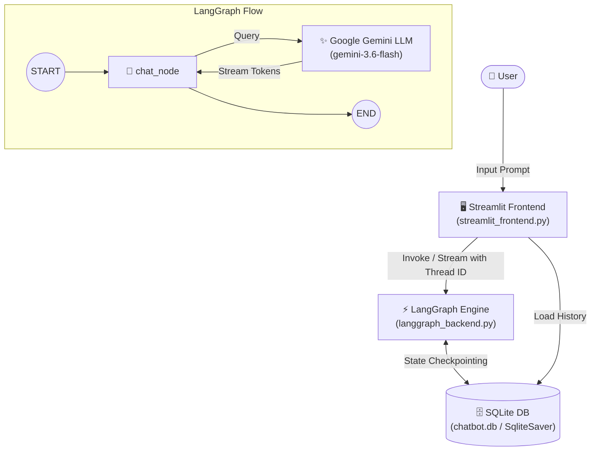

<div align="center">

# 🤖 LangGraph Multi-Thread AI Chatbot

### *An Intelligent, Stateful Conversational Assistant Powered by Google Gemini, LangGraph, and Streamlit*

[](https://python.org)
[](https://streamlit.io)
[](https://langchain-ai.github.io/langgraph/)
[](https://ai.google.dev/)
[](https://sqlite.org)

<p align="center">
  <a href="#-overview">Overview</a> •
  <a href="#-key-features">Key Features</a> •
  <a href="#-architecture">Architecture</a> •
  <a href="#-tech-stack">Tech Stack</a> •
  <a href="#-project-structure">Project Structure</a> •
  <a href="#-getting-started">Getting Started</a>
</p>

---

</div>

## 📖 Overview

This project is a **modern, stateful AI Chatbot application** built using **LangGraph** for orchestrating conversational state and graphs, **Google Gemini (`gemini-3.6-flash`)** as the underlying reasoning engine, and **Streamlit** for a responsive, real-time user interface.

With built-in **SQLite persistence (`SqliteSaver`)**, conversations persist seamlessly across sessions. Users can manage multiple independent conversation threads, resume historical chats, and stream AI responses in real time.

---

## ✨ Key Features

- 🧠 **LangGraph StateGraph Architecture**: Clean cyclic graph execution with typed state management (`ChatState`) and `add_messages` history reducers.
- 💾 **Persistent SQLite Checkpointing**: All chat sessions and message states are preserved in a local `chatbot.db` database using `SqliteSaver`.
- 🔀 **Multi-Thread Chat Management**: Seamlessly switch between different conversation threads or start a fresh chat with automatic UUID generation.
- ⚡ **Real-Time Token Streaming**: Real-time response streaming (`chatbot.stream(..., stream_mode='messages')`) for smooth interactive typing feedback.
- 🏷️ **Dynamic Thread Titles**: Automatically generates readable conversation labels in the sidebar based on the initial user prompt.
- 🎨 **Sleek Streamlit Interface**: Wide-layout UI with dedicated conversation sidebar, role-based chat bubbles, and auto-scrolling message feeds.

---

## 🏛️ Architecture



---

## 🛠️ Tech Stack

| Component | Technology | Purpose |
| :--- | :--- | :--- |
| **Frontend UI** | [Streamlit](https://streamlit.io/) | Web interface, sidebar history, chat display, and token streaming |
| **Orchestration** | [LangGraph](https://langchain-ai.github.io/langgraph/) | Conversational state graph, message reducers, and checkpointing |
| **LLM Provider** | [Google Gemini (`gemini-3.6-flash`)](https://ai.google.dev/) | High-speed, high-intelligence multimodal language model |
| **Persistence** | [SQLite3 / SqliteSaver](https://www.sqlite.org/) | Durable thread and checkpoint storage across app restarts |
| **Configuration** | [python-dotenv](https://github.com/theskumar/python-dotenv) | Environment variable and API key management |

---

## 📁 Project Structure

```text
CHATBOT/
├── .env.example             # Template for required environment variables
├── .gitignore               # Comprehensive Git exclusion rules (DB, keys, caches)
├── requirements.txt         # Project dependencies and version pins
├── req.txt                  # Minimal dependency list
├── langgraph_backend.py     # LangGraph backend graph, nodes, LLM, & checkpointer
└── streamlit_frontend.py    # Streamlit frontend UI, streaming, & thread navigation
```

---

## 🚀 Getting Started

### 1. Prerequisites

- **Python 3.10+** installed on your system.
- A **Google Gemini API Key** (get one free at [Google AI Studio](https://aistudio.google.com/)).

### 2. Clone and Setup Environment

```bash
# Clone the repository
git clone https://github.com/Asphane/stateful-gemini-chatbot.git
cd stateful-gemini-chatbot

# Create and activate a virtual environment
python3 -m venv venv
source venv/bin/activate    # On Windows: venv\Scripts\activate

# Install required dependencies
pip install -r requirements.txt
```

### 3. Configure Environment Variables

Create a `.env` file in the root directory (or copy from `.env.example`):

```bash
cp .env.example .env
```

Add your Google Gemini API key to `.env`:

```env
GOOGLE_API_KEY=AIzaSyYourActualApiKeyHere
```

### 4. Launch the Application

Run the Streamlit application:

```bash
streamlit run streamlit_frontend.py
```

The app will open automatically in your default browser at `http://localhost:8501`.

---

## 💡 How It Works

1. **State Persistence (`langgraph_backend.py`)**:
   - The graph is defined with `ChatState`, utilizing `Annotated[list[BaseMessage], add_messages]` to ensure message lists are append-only.
   - Every execution attaches a `configurable: {"thread_id": "..."}` that stores state checkpoints in `chatbot.db`.

2. **Thread Switching & UI (`streamlit_frontend.py`)**:
   - When a user starts a conversation, a unique `thread_id` is generated and tracked in `st.session_state`.
   - Selecting past conversations from the sidebar triggers `load_conversation(thread_id)`, reading saved state snapshots directly from the database and refreshing the message window.

---

## 🤝 Contributing

Contributions, issues, and feature requests are welcome! Feel free to check the [issues page](../../issues).

---

<div align="center">
  <sub>Built with ❤️ using LangGraph & Streamlit</sub>
</div>
