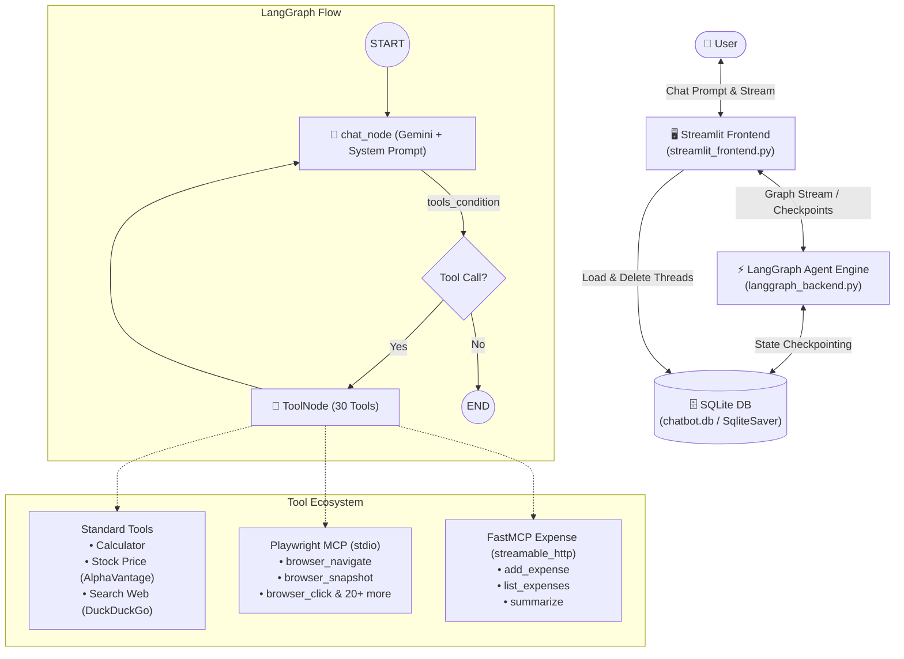

<div align="center">

# 🤖 LangGraph Multi-Thread AI Chatbot with MCP Multi-Server Integration

### *An Intelligent, Stateful Conversational Assistant with Dynamic MCP Tools, Web Automation, Financial Quotes & Persistence Powered by Google Gemini, LangGraph, and Streamlit*

[](https://python.org)
[](https://streamlit.io)
[](https://langchain-ai.github.io/langgraph/)
[](https://ai.google.dev/)
[](https://modelcontextprotocol.io/)
[](https://sqlite.org)

<p align="center">
  <a href="#-overview">Overview</a> •
  <a href="#-key-features">Key Features</a> •
  <a href="#-architecture">Architecture</a> •
  <a href="#-integrated-tools--mcp-servers">Tools & MCP</a> •
  <a href="#-tech-stack">Tech Stack</a> •
  <a href="#-project-structure">Project Structure</a> •
  <a href="#-getting-started">Getting Started</a>
</p>

---

</div>

## 📖 Overview

This project is an advanced, production-grade **stateful AI Chatbot application** built using **LangGraph** for multi-step agent orchestration, **Google Gemini (`gemini-2.0-flash`)** as the primary LLM reasoning engine, **Model Context Protocol (MCP)** for distributed multi-server tool capabilities, and **Streamlit** for a modern, real-time user interface.

With built-in **SQLite persistence (`SqliteSaver`)**, conversation threads and state checkpoints persist across restarts. The chatbot seamlessly coordinates between internal Python tools (math, web search, real-time stock prices) and external **MCP Servers** (including full **Playwright browser automation** and **FastMCP cloud expense tracking**).

---

## ✨ Key Features

- 🧠 **LangGraph Cyclic Agent Architecture**: Clean cyclic graph execution (`chat_node` $\leftrightarrow$ `tool_node`) with typed state management (`ChatState`) and `add_messages` history reducers.
- 🔌 **Model Context Protocol (MCP) Multi-Server Support**:
  - Dynamically loads tools from local `stdio` servers (`@playwright/mcp`) and remote `streamable_http` / `sse` servers.
  - Resilient per-server initialization ensuring offline servers do not disrupt the chatbot lifecycle.
- 🌐 **Web Automation & Real-Time Inspection**: Equipped with 24+ Playwright browser automation tools (`browser_navigate`, `browser_snapshot`, `browser_click`, `browser_take_screenshot`) to inspect live webpages and repositories.
- 💰 **Personal Finance & Expense Management**: Connected to FastMCP expense management tools (`add_expense`, `list_expenses`, `summarize`).
- 📈 **Stock Market & Math Capabilities**: Real-time ticker lookups via AlphaVantage API and arithmetic computation via the calculator tool.
- 💾 **Persistent SQLite Checkpointing**: Complete conversation threads are preserved in `chatbot.db` via `SqliteSaver` and restored into the sidebar automatically.
- 🔀 **Multi-Thread & Conversation Management**:
  - Switch smoothly between historical chats.
  - Auto-generate descriptive sidebar titles from the user's initial prompt snippet.
  - Delete unwanted threads (❌) directly from the UI.
- ⚡ **Real-Time Token & Tool Streaming**:
  - Instant token-by-token response streaming with `chatbot.stream(..., stream_mode='messages')`.
  - Dynamic `st.status` indicators that display executing tools in real time and complete summaries upon finish.

---

## 🏛️ Architecture



---

## 🛠️ Integrated Tools & MCP Servers

The chatbot dynamically unifies 30 built-in and distributed MCP tools:

### 1. Standard Built-in Tools
| Tool | Function | Description |
| :--- | :--- | :--- |
| **Calculator** | `calculator` | Evaluates arithmetic (`add`, `sub`, `mul`, `div`) with zero-division safeguards. |
| **Stock Price** | `get_stock_price` | Fetches real-time market data from AlphaVantage with request timeouts. |
| **Web Search** | `search_web` | Live web search via DuckDuckGo for breaking news and current events. |

### 2. MCP Server Integrations
| Server | Protocol | Tools Included | Capabilities |
| :--- | :--- | :--- | :--- |
| **Playwright MCP** | `stdio` (`npx @playwright/mcp`) | `browser_navigate`, `browser_snapshot`, `browser_click`, `browser_type`, `browser_take_screenshot`, `browser_evaluate`, etc. (24 tools) | Full headless browser automation to navigate URLs, inspect pages, interact with forms, and capture snapshots. |
| **Expense FastMCP** | `streamable_http` | `add_expense`, `list_expenses`, `summarize` (3 tools) | Expense logging, balance summaries, and financial tracking. |

---

## 💻 Tech Stack

| Component | Technology | Purpose |
| :--- | :--- | :--- |
| **Frontend UI** | [Streamlit](https://streamlit.io/) | Interactive sidebar, real-time token streaming, and dynamic tool status badges |
| **Agent Orchestration** | [LangGraph](https://langchain-ai.github.io/langgraph/) | Cyclic state graph, message reducers, tool routing, and checkpointing |
| **LLM Engine** | [Google Gemini (`gemini-2.0-flash`)](https://ai.google.dev/) | Multi-turn reasoning, tool selection, and answer synthesis |
| **Tool Protocol** | [langchain-mcp-adapters](https://github.com/langchain-ai/langchain-mcp-adapters) | Distributed Multi-Server MCP client connecting stdio & HTTP servers |
| **Browser Engine** | [Playwright MCP](https://github.com/microsoft/playwright-mcp) | Webpage navigation and DOM inspection |
| **Search Engine** | [DuckDuckGo Search](https://duckduckgo.com/) | Real-time search integration via `langchain-community` |
| **Persistence** | [SQLite3 / SqliteSaver](https://www.sqlite.org/) | Durable thread and checkpoint storage across app restarts |
| **Configuration** | [python-dotenv](https://github.com/theskumar/python-dotenv) | Environment variable and secret management |

---

## 📁 Project Structure

```text
CHATBOT/
├── .env.example             # Template for required environment variables & API keys
├── .gitignore               # Excludes SQLite database, keys, virtualenvs, & caches
├── requirements.txt         # Project dependencies with pinned versions
├── req.txt                  # Clean dependency list
├── langgraph_backend.py     # LangGraph graph, nodes, MCP client, tools, & checkpointer
└── streamlit_frontend.py    # Streamlit frontend UI, streaming loop, & sidebar management
```

---

## 🚀 Getting Started

### 1. Prerequisites

- **Python 3.10+** installed on your system.
- **Node.js 18+ & npx** installed (required for Playwright MCP).
- A **Google Gemini API Key** (get one free at [Google AI Studio](https://aistudio.google.com/)).

### 2. Clone and Setup Environment

```bash
# Clone repository
git clone https://github.com/Asphane/stateful-gemini-chatbot.git
cd stateful-gemini-chatbot

# Create and activate virtual environment
python3 -m venv venv
source venv/bin/activate    # On Windows: venv\Scripts\activate

# Install required dependencies
pip install -r requirements.txt
```

### 3. Configure Environment Variables

Create a `.env` file from `.env.example`:

```bash
cp .env.example .env
```

Add your Google Gemini API key:

```env
GOOGLE_API_KEY=AIzaSyYourActualApiKeyHere
```

### 4. Launch the Application

Start the Streamlit application:

```bash
streamlit run streamlit_frontend.py
```

The app will open automatically in your default browser at `http://localhost:8501`.

---

## 💡 How It Works

1. **MCP Discovery & Startup (`langgraph_backend.py`)**:
   - On startup, `load_mcp_tools()` connects to each server in `MCP_SERVERS` independently, retrieving tools and converting them into standard LangChain `BaseTool` instances.
   - All 30 tools are bound to Gemini with `llm.bind_tools(tools)`.

2. **Graph Execution & Guardrails**:
   - `chat_node` prepends `SYSTEM_PROMPT` to enforce concise, factual, and tool-assisted responses.
   - When tools are called, `tools_condition` routes to `ToolNode`, executes the corresponding tool (local Python function or MCP remote call), and passes the results back to Gemini.
   - Every graph execution turn is saved to `chatbot.db` using `SqliteSaver`.

3. **Frontend Streaming & Thread Management (`streamlit_frontend.py`)**:
   - Previous conversation threads are restored from SQLite checkpoints on startup via `retrieve_all_threads()`.
   - Users can create new chats, switch between conversations, or delete threads with the `❌` button.
   - Tokens stream in real time while `st.status` visually reports running and completed tools.

---

## 🤝 Contributing

Contributions, issues, and feature requests are welcome! Feel free to open an issue or pull request.

---

<div align="center">
  <sub>Built with ❤️ using LangGraph, Google Gemini, Model Context Protocol (MCP) & Streamlit</sub>
</div>
